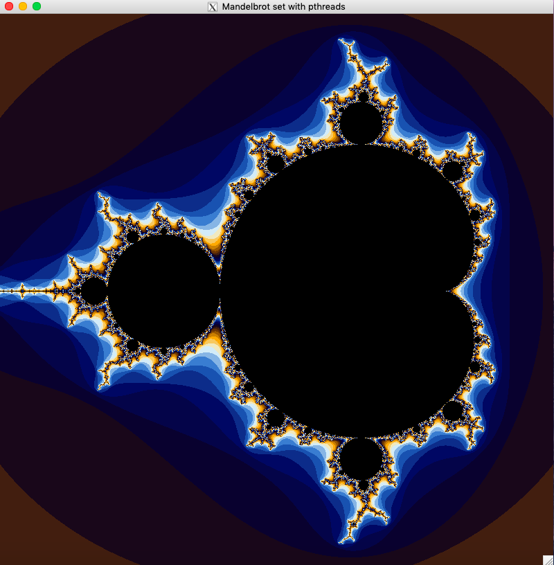

# Projeto pthreads-mandelbrot-fractal

Projeto para realização de um sistemas que utiliza a biblioteca pthreads para construção da estrutura do algoritmo de [Fractal Mandelbrot](https://pt.wikipedia.org/wiki/Conjunto_de_Mandelbrot), para a disciplina de Processamento de Alto Desepenho - Unisinos/2019.



## Execução

Necessário fazer a instalação do X11 disponível no site [XQuartz](https://www.xquartz.org/), e determinar os caminhos dos diretórios específicos no buil do projeto.

```
git clone https://github.com/savannadenega/pthreads-mandelbrot-fractal
cd pthreads-mandelbrot-fractal/mandelbrot-fractal
gcc main.c -o main -I/opt/X11/include -I/opt/X11/include/X11 -L/opt/X11/lib -L/opt/X11/lib/X11 -lX11
./main
```

## Navegação na aplicação

Usar as teclas M e N para aumentar ou diminuir o zoom na tela de resultado.

## Referências

https://github.com/rafaeleyng/mandelbrot-fractal

http://www.geeks3d.com/20120102/programming-tutorial-simple-x11-x-window-code-sample-for-linux-and-mac-os-x/

http://www.cs.nthu.edu.tw/~ychung/homework/para_programming/seq_mandelbrot_c.htm

https://locklessinc.com/articles/mandelbrot/

https://gist.github.com/andrejbauer/7919569

http://jonisalonen.com/2013/lets-draw-the-mandelbrot-set/
